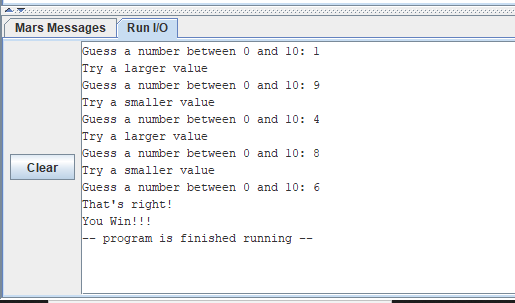
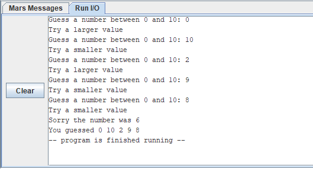

# Module 2 Challenge Activity: Guessing Game

- [Module 2 Challenge Activity: Guessing Game](#module-2-challenge-activity-guessing-game)
	- [Learning Activities](#learning-activities)
	- [Purpose](#purpose)
	- [Skills and Knowledge](#skills-and-knowledge)
	- [Task 1: Read an integer from the User](#task-1-Read-an-integer)
	- [Task 2: Compare user input](#task-2-compare-user-input)
	- [Task 3: Loop](#task-3-add-an-immediate-value)
	- [Task 4: End Game](#task-4-end-game)
	- [Submission Checklist](#submission-checklist)
	- [Other Resources](#other-resources)


## Learning Activities

The learning activities related to this assignment are in the `la` folder of this project. If you need to review the concepts, follow the [LA README](la/README.md)

## Purpose

The purpose of this assignment is to introduce the concepts of branches and to practice using arrays.

## Skills and Knowledge

The goal of this lab is to get some initial experience programming in MIPS assembly language. Specifically, by the end of this assignment, you should feel comfortable:
1. Getting user input
2. Creating if/else style branches
3. Creating for/while loop style branches
4. Reading and writing arrays of memory


## Task 1: Read an integer from the User

Your first task is to print a message that asks the user to enter a number between 0 and 10
and then reads and stores the number the user entered.

Begin working in the file template (`ca.asm`) provided in the `ca` folder.
```mips
# Data for the program goes here
.data

# Code goes here
.text
main:

	li $v0, 10		# 10 is the exit program syscall
	syscall			# execute call

## end of ca.asm
```
In the `.data` directive, declare a string with the user prompt.  You should also
declare a memory location and store the secret value.  (I chose 6).

In the `main` procedure of your `.text` directive use syscalls to display the prompt
and read the user input.


## Task 2: Compare user input
Your next task is to add code to compare the user input to the secret value.
If the user input is smaller than the secret value you should tell the user
to guess a larger value
If the user input is larger than the secret value you should tell the user
to guess a smaller value
If the user input is the same as the secret value you should tell the user
they win.


## Task 3: Loop
The final task is to setup Tasks 1 and 2 in a loop.

You should allow the user to guess 5 times.  If they do not guess the secret after
5 guesses. The loop should end.

If they guess the secret value in less than 5 guesses you should end the loop early.


## Task 4: End Game
If the user lost (i.e. did not guess the secret value) you should print a message with the secret value, as well as all the numbers that the user guessed.
(You will want to save their guesses in an array).

If the user won (i.e. they guessed the secret value) you should print a message that they won!


Remember to document your register usage and to thoroughly comment your code.
```mips
# Registers used:
##...
#      $t0 - used to hold the secret value.
##...
       lw $t0, secret        #$t0 = secret
##...
```

### Sample Output Win


### Sample Output Win


## Submission Checklist
- [ ] Complete learning activities
- [ ] Complete challenge activities
- [ ] Save and `commit` my code in github desktop
- [ ] `Push` the code to github.com
- [ ] Uploaded video of code walkthrough  in `Canvas`
- [ ] Add your github repo as a comment to your assignment in `Canvas`.
## Other Resources
For more information go to [How to page](HOWTO.md)
